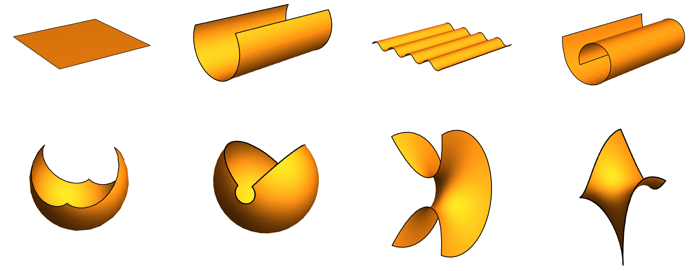

<big><big><b>Abstract</b></big></big>

Many thin three-dimensional elastic
  bodies can be reduced to elastic shells: two-dimensional elastic bodies whose
  reference shape is not necessarily flat. More generally, morphoelastic shells
  are elastic shells that can remodel and grow in time. These idealized objects
  are suitable models for many physical, engineering, and biological systems.
  Here, we formulate a general geometric theory of nonlinear morphoelastic
  shells that describes both the evolution of the body shape, viewed as an
  orientable surface, as well as its intrinsic material properties such as its
  reference curvatures. In this geometric theory, bulk growth is modeled using
  an evolving referential configuration for the shell, the so-called material
  manifold. Geometric quantities attached to the surface, such as the first and
  second fundamental forms, are obtained from the metric of the
  three-dimensional body and its evolution. The governing dynamical equations
  for the body are obtained from variational consideration by assuming that both
  fundamental forms on the material manifold are dynamical variables in a
  Lagrangian field theory. In the case where growth can be modeled by a Rayleigh
  potential, we also obtain the governing equations for growth in the form of
  kinetic equations coupling the evolution of the first and the second
  fundamental forms with the state of stress of the shell. We apply these ideas
  to obtain stress-free growth fields of a planar sheet, the time evolution of a
  morphoelastic circular cylindrical shell subject to time-dependent internal
  pressure, and the residual stress of a morphoelastic planar circular
  shell.

